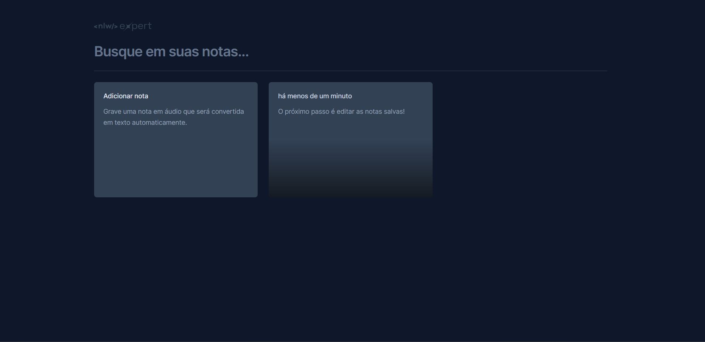

**Salve notas no navegador**



# NLW Expert Notes (React)

App desenvolvido durante o NLW Expert, dirigido pela Rocketseat utilizando React, TypeScript, Tailwind e a SpeechRecognition API.

## Execute o projeto

Após clonar o repositório, acesse a pasta do projeto e execute os comandos abaixo:

```sh
npm install
npm run dev
```

Acesse http://localhost:5173 para visualizar a aplicação.
